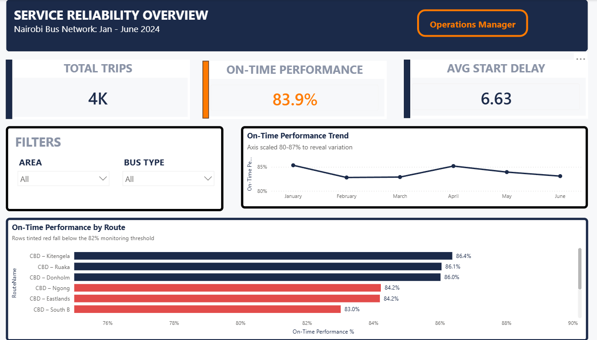
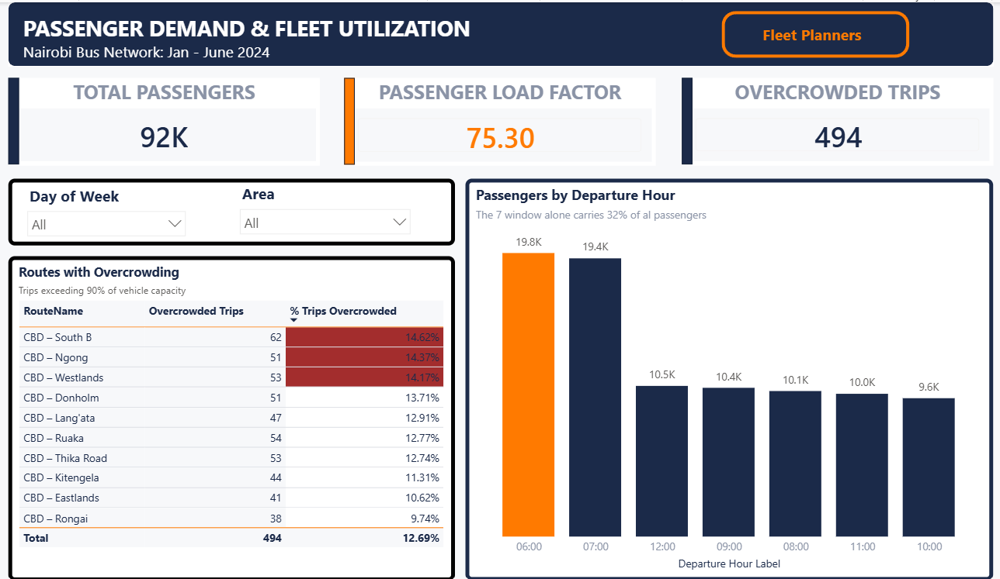
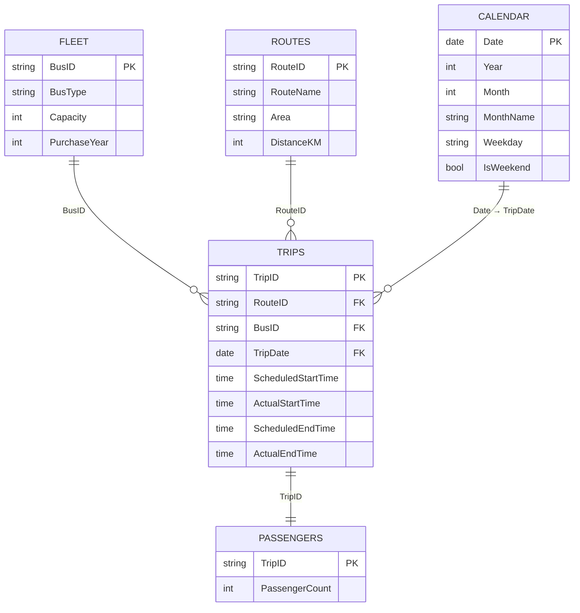

# Nairobi Bus Network — Service Reliability & Demand Dashboard

**An end-to-end Power BI analytics solution for an urban transit operator — built on a 5-table star schema, 4,012 trip records, and a custom-designed executive theme.**

> 📂 **[Download the .pbix file](Power_BI_Mini_Project.pbix)** · 📊 **[Browse the raw datasets](/data)**

---

### The brief

A city bus operator running **10 routes and a 30-vehicle fleet** had six months of trip logs sitting in spreadsheets and no way to answer two questions its managers ask every week:

1. **Are we running on time — and if not, where does it break down?**
2. **Are we putting the right buses where the passengers actually are?**

This project turns those spreadsheets into a two-page decision tool, each page purpose-built for a different audience: **Operations Managers** who own punctuality, and **Fleet Planners** who own capacity allocation.

---

### Dashboard preview

**Page 1 — Service Reliability** *(Operations Manager)*

**Page 2 — Passenger Demand & Fleet Utilization** *(Fleet Planners)*

---

### Skills demonstrated

| Skill | How it shows up in this project |
| --- | --- |
| **Dimensional modelling** | Purpose-built star schema — one fact table, four conformed dimensions, no bidirectional filters, no ambiguity |
| **DAX** | 8 measures covering counts, weighted ratios, threshold logic and time-intelligence-ready aggregation |
| **Power Query (M)** | Type coercion on time columns, derived duration and hour-bucket columns, referential integrity checks across five sources |
| **Time intelligence** | A dedicated, marked Date table (182 continuous days) driving the monthly trend and weekday slicer |
| **Report design** | Custom-authored **"Transit Executive"** theme (navy `#1B2A49` / signal orange `#FF7A00`), KPI card layer, shape-based visual hierarchy |
| **Stakeholder thinking** | Two pages, two personas, two decisions — not one dashboard trying to serve everyone |
| **Interactivity** | Cross-filtering slicers on Bus Type, Area and Weekday, with cross-visual highlighting throughout |

---

### The data model

Built as a **clean star schema** — the single most important design decision in the project. `Trips` is the fact table; everything else filters into it on a one-to-many relationship, so every measure resolves without ambiguity and the DAX stays readable.

| Table | Grain | Rows | Role |
| --- | --- | ---: | --- |
| `Trips` | One scheduled trip | 4,012 | **Fact** |
| `Passengers` | One trip | 4,012 | Fact extension (1:1 on `TripID`) |
| `Fleet` | One bus | 30 | Dimension |
| `Routes` | One route | 10 | Dimension |
| `Calendar` | One day | 182 | Date dimension |

---

### Measures written

Full definitions and design notes in **[DAX-Measures.md](DAX-Measures.md)**.

| Measure | What it answers |
| --- | --- |
| `Total Trips` | Volume of service delivered |
| `On-Time Performance %` | Share of trips departing within the 5-minute tolerance |
| `Average Start Delay` | Average minutes late at departure |
| `Total Passengers` | Total ridership |
| `Passenger Load Factor` | Seats filled ÷ seats offered — the true utilization number |
| `Overcrowded Trips` | Trips running above the 80% comfort threshold |
| `% Trips Overcrowded` | Overcrowding as a share of service |
| `Departure Hour Label` | Derived column bucketing schedules into hourly bands |

---

### Data used

| Field | Detail |
| --- | --- |
| Scope | Simulated Nairobi bus network — 10 CBD-radial routes across Westlands, Eastlands, South Nairobi, Kiambu and Kajiado |
| Period | 1 January – 30 June 2024 (182 continuous days) |
| Records | 4,012 trips · 4,012 passenger counts · 30 buses · 10 routes |
| Fleet mix | Articulated Bus (11) · Mini Bus (11) · Standard Bus (8), capacities 25–60 seats, model years 2012–2021 |
| Measures tracked | Scheduled vs. actual departure and arrival, passenger count, seat capacity, route distance |
| Volume analysed | **92,321 passenger journeys** against **163,898 seats offered** |

---

### Key insights

**1. On-time performance sits at 61.8% — and it isn't moving.**
Across six months the metric never leaves a 60.6–62.8% band. This is not a bad-month problem; it is a **structurally optimistic timetable**. The median trip departs exactly 5 minutes late and the average start delay is **6.8 minutes**, which points at the schedule, not the drivers.

**2. Nearly half the network runs before 8 AM.**
The 06:00 and 07:00 departure bands carry **44% of all trips and 43% of all passengers**. Every other hourly band operates at roughly half that intensity — the fleet is heavily front-loaded into the morning commute.

**3. Midday is the hidden pressure point.**
The 12:00 band records the **highest overcrowding rate (26.7%)**, the **worst average delay (7.4 min)** and joint-lowest punctuality — despite running less than a third of the morning's trips. Capacity pulled toward the AM peak is leaving midday trips exposed.

**4. Westlands is the route to fix first.**
CBD – Westlands runs the **fewest trips (385)**, the **fullest buses (24.2% overcrowded)** and the **longest average delay (7.5 min)** in the network. Fewest trips, fullest buses, worst punctuality — that is a textbook undersupply signature, and the clearest capacity-reallocation candidate in the dataset.

**5. Standard Buses underperform on both axes.**
They post the **lowest on-time rate (59.5%)** and the **highest overcrowding rate (23.2%)** of the three vehicle classes, while carrying the smallest average capacity (34 seats). They are being deployed on demand they cannot absorb.

**6. Utilization has headroom — but it's badly distributed.**
The network-wide load factor is **56.3%**, comfortably below capacity. Yet **893 trips (22.3%)** still run above the 80% comfort threshold. The operator does not have a fleet-size problem; it has an **allocation** problem.

**7. 3% of scheduled service leaves no trace.**
120 trips have a scheduled departure but **no logged actual times** — cancellations or missed telemetry. Rather than dropping them, the model retains them as scheduled-but-undelivered service, so punctuality is measured against what was *promised*, not just what was *recorded*.

---

### Recommendations delivered

- **Rebase the timetable** on observed run times before chasing driver performance — a 5-minute median delay is a planning artefact.
- **Shift two morning slots into the 11:00–13:00 band**, where overcrowding and delay both peak on thin service.
- **Reassign Articulated Buses to CBD – Westlands**, the network's clearest undersupply case.
- **Retire Standard Buses** from high-load corridors, or pair them with a second departure.
- **Instrument the 3% telemetry gap** — an operator cannot manage punctuality it cannot observe.

---

### How to explore this project

1. Download `Power_BI_Mini_Project.pbix` and open it in **Power BI Desktop** (free).
2. The five source files live in `/data` — reconnect them via *Transform Data → Data source settings* if you want to refresh.
3. Start on **Service Reliability**, filter to *Standard Bus* in the Bus Type slicer, and watch the on-time card drop. Then move to **Demand & Utilization** and filter to a weekday.

---

### Tools

**Power BI Desktop** · **DAX** · **Power Query (M)** · **Star schema modelling** · **Microsoft Excel** · Custom theme authoring (JSON)

---

### About the data

The dataset is a **simulated** transit network built to mirror the structure, geography and operating patterns of Nairobi's CBD-radial bus corridors. It was chosen so the modelling, DAX and design work could be demonstrated end-to-end on realistic data volumes and relationships.

---

**Wanjiku Waweru** · BBS Financial Engineering, Strathmore University
[GitHub](https://github.com/ShikohWaweru)

